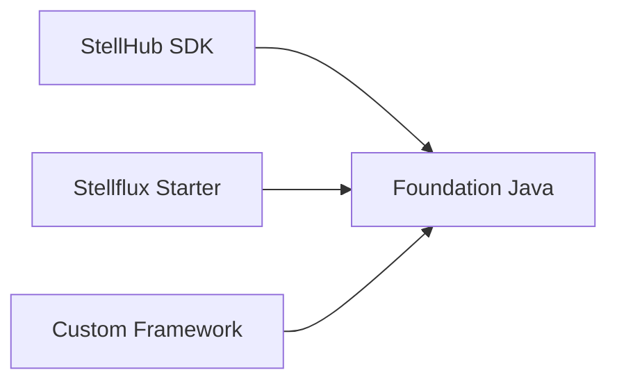

# StellHub Foundation Java

`stellhub-foundation-java` 是 StellHub Java 生态的基础能力库，提供运行时上下文、请求上下文、资源属性、链路头模型和错误语义映射等框架无关能力。

## 项目概述

本仓库定位为 StellHub Java 技术栈的底层基础库。它不依赖 Spring，也不绑定具体 Web 框架，而是为 SDK、Starter、业务框架和基础设施组件提供统一的数据模型与公共工具。

## 当前状态

| 项目 | 说明 |
| --- | --- |
| 稳定性 | 开发中 |
| 项目类型 | Java 基础库 |
| 适用对象 | SDK、Starter、自研框架、基础设施组件 |
| 维护方 | StellHub |

## 解决什么问题

- 统一 OpenTelemetry resource 属性模型。
- 统一 Kubernetes 和 `STELLAR_*` 环境变量读取。
- 提供 W3C trace headers 与 `X-Stellar-*` 头模型。
- 提供运行时上下文和请求上下文抽象。
- 提供日志、链路和指标中的错误语义映射。

## 不解决什么问题

- 不提供 Spring Boot 自动装配。
- 不直接实现 HTTP 服务端或客户端。
- 不负责日志、指标、链路的完整上报链路。
- 不承载业务领域模型。

## 核心能力

| 能力 | 说明 |
| --- | --- |
| Resource 属性 | 统一服务、主机、容器、Kubernetes 属性 |
| Trace Header | 抽象 W3C 和内部链路头 |
| Runtime Context | 描述进程运行时信息 |
| Request Context | 描述请求维度上下文 |
| Error Semantics | 统一错误属性映射 |

## 架构说明



## 快速开始

```xml
<dependency>
    <groupId>io.github.stellhub</groupId>
    <artifactId>stellhub-foundation-java</artifactId>
    <version>${stellhub.version}</version>
</dependency>
```

## 配置说明

本项目主要提供模型和工具方法，通常不直接读取复杂业务配置。运行环境相关属性建议通过环境变量、系统属性或上层 Starter 传入。

| 配置来源 | 说明 |
| --- | --- |
| Environment Variables | 运行环境属性 |
| System Properties | JVM 系统属性 |
| Framework Adapter | 上层框架适配注入 |

## 本地开发

```bash
mvn clean verify
```

## 版本与升级

- `MAJOR`：不兼容模型、字段或公共 API 变更。
- `MINOR`：向后兼容的新能力。
- `PATCH`：向后兼容的问题修复。

## 可观测性

本项目本身不直接上报指标，但会影响上层日志、链路和指标的资源属性与错误属性。修改字段命名时必须评估全链路影响。

## 故障排查

### 上层可观测性属性不完整

1. 检查运行环境变量是否存在。
2. 检查上层 Starter 是否正确注入上下文。
3. 检查字段映射是否与平台规范一致。

## 安全说明

基础库不应默认输出运行环境中的敏感值，上层组件需要按平台规范处理日志和属性。

## 目录结构

```text
.
├── src/            # 基础库源码
├── pom.xml         # Maven 构建文件
└── README.md       # 项目说明
```

## 贡献规范

- 公共模型变更必须说明兼容性影响。
- 字段语义变更必须同步更新 README 或 docs。
- 不应引入重量级框架依赖。

## 支持

由 StellHub 维护。建议通过 GitHub Issues 记录问题、需求和设计讨论。

## 许可证

以仓库内 `LICENSE` 文件为准。